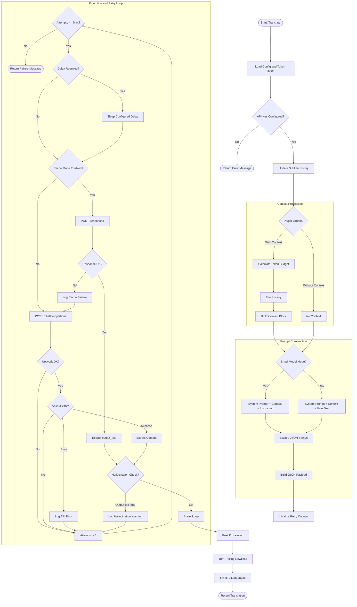

## 源代码版本并不是设计给普通用户使用的（我还没有完全测试）
## 如果你只是想正常使用插件，请在这里下载：<a href="#fully-automatic-installation-recommended">Fully Automatic Installation</a>
## 如果你愿意，也可以尝试源码版本，但普通用户不建议直接从源码安装

- 【PotPlayer AI 翻译插件安装教程 - 哔哩哔哩】 https://b23.tv/ntF2dxu


<a id="readme-top"></a>

[![Forks][forks-shield]][forks-url]
[![Stargazers][stars-shield]][stars-url]
[![Issues][issues-shield]][issues-url]
[![License][license-shield]][license-url]
<div align="center">

<a href="https://doloffer.com/friend/Ag2kFHdx" target="_blank">
  
</a>

### [DolOffer - 一站式数字订阅充值平台](https://doloffer.com/friend/Ag2kFHdx)

主营 GPT、Claude 等 AI 服务会员正版订阅充值。  
💰 使用折扣码：**AI8888**  
🚀 极速发货，售后无忧。

</div>
<div align="right">
  <a href="https://github.com/Felix3322/PotPlayer_ChatGPT_Translate/blob/master/docs/readme_zh.md">简体中文</a> |
  <a href="https://github.com/Felix3322/PotPlayer_ChatGPT_Translate/blob/master/docs/readme_zh-tw.md">繁體中文</a> |
  <strong>English</strong>
</div>

<div align="center">
  <h1>PotPlayer_ChatGPT_Translate 🚀</h1>

  <p>
    A PotPlayer subtitle translation plugin powered by OpenAI-compatible AI APIs.
    <br>
    It translates subtitles in real time and can use subtitle context to improve accuracy.
  </p>

  <p>
    
  </p>

  <p><em>Works on my machine — but bug reports are welcome.</em></p>

  <p>
    <a href="https://github.com/Felix3322/PotPlayer_ChatGPT_Translate/releases/latest"><strong>Download Latest Release</strong></a>
    &nbsp;&middot;&nbsp;
    <a href="https://github.com/Felix3322/PotPlayer_ChatGPT_Translate/issues/new?labels=bug&template=bug-report---.md">Report Bug</a>
    &nbsp;&middot;&nbsp;
    <a href="https://github.com/Felix3322/PotPlayer_ChatGPT_Translate/issues/new?labels=enhancement&template=feature-request---.md">Request Feature</a>
  </p>
</div>

---

## Important Notice

The source-code version of this project is mainly for development and testing. It is not currently designed as the recommended installation method for normal users, and not every source-code path has been fully tested.

If you only want to use the plugin, please install it from the release package:

> Recommended download: [Fully Automatic Installation](#fully-automatic-installation-recommended)

The repository was temporarily unavailable for a period of time because my GitHub account was suspended. The project is now available again.

Video tutorial:

- Bilibili: [PotPlayer AI Translation Plugin Installation Tutorial](https://b23.tv/ntF2dxu)

---

## Table of Contents

1. [What This Project Does](#what-this-project-does)
2. [Features](#features)
3. [Installation](#installation)
   - [Fully Automatic Installation Recommended](#fully-automatic-installation-recommended)
   - [Manual Installation](#manual-installation)
4. [Configuration Reference](#configuration-reference)
5. [Available Model Examples](#available-model-examples)
6. [Usage](#usage)
7. [Translation Examples](#translation-examples)
8. [Video Tutorial](#video-tutorial)
9. [Logic Flowchart](#logic-flowchart)
10. [Built With](#built-with)
11. [Roadmap](#roadmap)
12. [Contributing](#contributing)
13. [License](#license)
14. [Contact](#contact)
15. [Acknowledgments](#acknowledgments)

---

## What This Project Does

**PotPlayer_ChatGPT_Translate** is a subtitle translation plugin for PotPlayer.

It sends subtitle text to an AI model through an OpenAI-compatible API endpoint and returns translated subtitles directly inside PotPlayer. Compared with traditional subtitle translation tools, AI models can often handle context, idioms, jokes, cultural references, and ambiguous dialogue more naturally.

The plugin provides two main script variants:

- **With context**: uses previous subtitles as context. Translation quality is usually better, but latency and token usage may be higher.
- **Without context**: translates each subtitle more independently. It is faster and cheaper, but may misunderstand pronouns, references, jokes, or short lines.

This project is not limited to OpenAI models. Any model or service that follows a compatible `chat/completions` API format can potentially be used.

<p align="right">(<a href="#readme-top">back to top</a>)</p>

---

## Features

- Real-time subtitle translation inside PotPlayer.
- Context-aware translation mode.
- No-context translation mode for faster requests.
- OpenAI-compatible API support.
- Custom API base URL support.
- API-key and no-key endpoint support.
- Optional retry behavior.
- Optional request delay.
- Optional context cache mode.
- Optional small-model prompt mode.
- Optional hallucination check for abnormal translation output.
- Installer-based automatic setup.
- Manual installation support.

<p align="right">(<a href="#readme-top">back to top</a>)</p>

---

## Installation

### Fully Automatic Installation Recommended

This is the recommended method for normal users.

1. Download the latest installer from:

   [Latest Release](https://github.com/Felix3322/PotPlayer_ChatGPT_Translate/releases/latest)

2. Run `installer.exe`.

3. Approve the Windows administrator prompt if it appears.

4. Confirm the PotPlayer plugin folder.

   The installer will try to detect your PotPlayer path automatically. The target folder should usually be:

   ```text
   ...\PotPlayer\Extension\Subtitle\Translate
   ```

   If PotPlayer is installed in a custom location, manually select the correct `Translate` folder.

5. Choose the plugin variant.

   - **With context**: better translation quality, slightly higher latency and token usage.
   - **Without context**: faster, cheaper, but less context-aware.

6. Configure the model and API endpoint.

   Example model field:

   ```text
   gpt-4.1-nano
   ```

   Example with custom API endpoint:

   ```text
   gpt-4.1-nano|https://api.openai.com/v1/chat/completions
   ```

7. Enter your API key if required.

   If your API endpoint does not require a key, leave the key field blank and use **Verify**. If the empty-key test succeeds, the installer will automatically inject `nullkey`.

8. Click **Install**.

   The installer will copy the required plugin files into PotPlayer’s subtitle translation extension folder. You may also register the uninstaller entry so the plugin can be removed cleanly later.

After installation, check the plugin inside PotPlayer:

1. Open PotPlayer.
2. Press **F5** to open Preferences.
3. Go to **Extensions > Subtitle translation**.
4. Select **ChatGPT Translate**.
5. Set the source and target languages.
6. Confirm the model, API URL, and API key settings.

Installer defaults are written once. If you later change settings inside PotPlayer’s plugin panel, PotPlayer’s own settings will override the installer defaults.

<p align="right">(<a href="#readme-top">back to top</a>)</p>

---

### Manual Installation

Manual installation is mainly intended for advanced users.

1. Download the latest ZIP package from the repository or release page.

2. Extract the ZIP file.

3. Copy the plugin files into PotPlayer’s subtitle translation extension folder:

   ```text
   C:\Program Files\DAUM\PotPlayer\Extension\Subtitle\Translate
   ```

   If your PotPlayer is installed somewhere else, replace the path with your actual PotPlayer installation path.

4. Copy the required files:

   ```text
   ChatGPTSubtitleTranslate.as
   ChatGPTSubtitleTranslate.ico
   ```

5. Open PotPlayer Preferences by pressing **F5**.

6. Go to:

   ```text
   Extensions > Subtitle translation
   ```

7. Select **ChatGPT Translate**.

8. Configure the model name, API URL, API key, source language, and target language.

Important:

> If you switch between the context-aware script and the no-context script, replace the related `.as` files together.
>
> Older script copies may use shared helper names such as `FormatFailureTranslation`, which can cause PotPlayer to report a conflict depending on which script loads first. Current files use uniquely prefixed helpers to avoid this issue.

<p align="right">(<a href="#readme-top">back to top</a>)</p>

---

## Configuration Reference

The plugin mainly uses the **Model Name** field and the **API Key** field.

### Basic Model Name

If you only enter a model name, the plugin uses the default API URL configured by the script or installer.

```text
gpt-4.1-nano
```

### Custom API Base URL

Use this format:

```text
ModelName|API Base URL
```

Example:

```text
gpt-4.1-nano|https://api.openai.com/v1/chat/completions
```

### No-Key Endpoint

If your endpoint does not require an API key, add `nullkey`.

```text
ModelName|API Base URL|nullkey
```

Example for local deployment:

```text
qwen2.5:7b|http://127.0.0.1:11434/v1/chat/completions|nullkey
```

You can also use a model name with `nullkey` directly:

```text
gpt-4.1-nano|nullkey
```

This is useful when the installer or script already knows the default endpoint.

### Optional Parameters

You can append optional parameters after the model and API URL. Each option is separated by `|`.

Full format:

```text
ModelName|API Base URL|nullkey|delay_ms|retryN|cache=auto/off|smallmodel=0/1|checkhallucination=0/1
```

Available options:

| Option | Meaning |
| --- | --- |
| `nullkey` | Use this when the endpoint does not require an API key. |
| `delay_ms` | Digits only. Adds a delay before requests or retries depending on retry mode. |
| `retry0` | No retry. |
| `retry1` | Retry once when the response is empty. |
| `retry2` | Keep retrying until a response is returned, without delay. |
| `retry3` | Keep retrying until a response is returned, with delay before every attempt. |
| `cache=auto` | Enable context cache mode when available. Context version only. Falls back to normal chat mode if unsupported. |
| `cache=off` | Disable context cache mode. |
| `smallmodel=0` | Disable small-model prompt mode. |
| `smallmodel=1` | Enable prompt mode optimized for smaller models. |
| `checkhallucination=0` | Disable hallucination-length check. |
| `checkhallucination=1` | Retry if the translated output is more than 5 times longer than the source subtitle. |

Example with several options:

```text
gpt-4.1-nano|https://api.openai.com/v1/chat/completions|nullkey|500|retry1|cache=auto|smallmodel=1|checkhallucination=1
```

### API Key

Enter your API key in the API key field if your endpoint requires one.

If your endpoint does not require a key:

1. Leave the key field blank.
2. Click **Verify**.
3. If verification succeeds, the installer will inject `nullkey`.

You can optionally test your API key here:

[keytest.obanarchy.org](https://keytest.obanarchy.org/)

<p align="right">(<a href="#readme-top">back to top</a>)</p>

---

## Available Model Examples

These are examples only. Actual availability depends on your API provider, account access, endpoint compatibility, and model naming rules.

Use this general format:

```text
ModelName|API Base URL|nullkey(optional)|delay_ms(optional)|retryN(optional)|cache=auto/off(optional)|smallmodel=0/1(optional)|checkhallucination=0/1(optional)
```

### OpenAI-Compatible Examples

```text
OpenAI GPT-5: gpt-5|https://api.openai.com/v1/chat/completions
OpenAI GPT-5 Mini: gpt-5-mini|https://api.openai.com/v1/chat/completions
OpenAI GPT-5 Nano: gpt-5-nano|https://api.openai.com/v1/chat/completions
OpenAI GPT-4.1: gpt-4.1|https://api.openai.com/v1/chat/completions
OpenAI GPT-4.1 Mini: gpt-4.1-mini|https://api.openai.com/v1/chat/completions
OpenAI GPT-4o: gpt-4o|https://api.openai.com/v1/chat/completions
OpenAI GPT-4 Turbo: gpt-4-turbo|https://api.openai.com/v1/chat/completions
OpenAI GPT-3.5 Turbo: gpt-3.5-turbo|https://api.openai.com/v1/chat/completions
```

### Other Cloud Provider Examples

```text
Gemini Flash: gemini-3-flash-preview|https://generativelanguage.googleapis.com/v1beta/openai/chat/completions
Gemini 2.0 Flash: gemini-2.0-flash|https://generativelanguage.googleapis.com/v1beta/openai/chat/completions
DeepSeek Chat: deepseek-chat|https://api.deepseek.com/v1/chat/completions
Tongyi Qianwen: qwen-plus|https://dashscope-intl.aliyuncs.com/compatible-mode/v1/chat/completions
SiliconFlow: siliconflow-chat|https://api.siliconflow.cn/v1/chat/completions
ERNIE Bot: ernie-4.0-turbo-8k|https://qianfan.baidubce.com/v2/chat/completions
Moonshot v1: moonshot-v1-128k|https://api.moonshot.cn/v1/chat/completions
Yi 34B Chat: yi-34b-chat|https://api.lingyi.ai/v1/chat/completions
Mistral Large: mistral-large|https://api.mistral.ai/v1/chat/completions
Groq Llama 3: llama3-70b-8192|https://api.groq.com/openai/v1/chat/completions
Fireworks Mixtral: accounts/fireworks/models/mixtral-8x7b-instruct|https://api.fireworks.ai/inference/v1/chat/completions
Perplexity Sonar Large: pplx-70b-online|https://api.perplexity.ai/chat/completions
```

### Local Deployment Example

For local OpenAI-compatible services, use `nullkey` if no API key is required.

```text
model-name|http://127.0.0.1:PORT/v1/chat/completions|nullkey
```

Example:

```text
qwen2.5:7b|http://127.0.0.1:11434/v1/chat/completions|nullkey
```

Model names shown in the installer may be localized when possible. You can replace the examples above with any compatible model supported by your API provider.

<p align="right">(<a href="#readme-top">back to top</a>)</p>

---

## Usage

After installation and configuration, play a video with subtitles in PotPlayer.

The plugin will automatically send subtitle text to the configured AI endpoint and return translated subtitles in real time.

For best results:

- Use the context-aware version for movies, TV shows, anime, documentaries, and dialogue-heavy content.
- Use the no-context version when speed and lower token usage matter more than contextual accuracy.
- Use a smaller or cheaper model if you translate large amounts of subtitles.
- Use a stronger model if the content contains jokes, slang, cultural references, technical terms, or complicated dialogue.
- Enable `checkhallucination=1` if your model sometimes produces abnormally long output.
- Add a request delay if your API provider has strict rate limits.

<p align="right">(<a href="#readme-top">back to top</a>)</p>

---

## Translation Examples

### Google Translate vs AI Translation

Original subtitle:

> You're gonna old yeller my f**king universe.

Google Translate result:

> 你要老了我他妈的宇宙吗?


This translation is literal and does not understand the cultural reference.

AI translation result:

> 你要像《老黄犬》一样对待我的宇宙?


This result captures the reference to *Old Yeller* and produces a more meaningful subtitle.

---

### Without Context vs With Context

Original subtitle:

> But being one in real life is even better.

AI translation without context:

> 但是，在现实生活中成为一个人甚至更好。


This translation is grammatically valid but misses what “one” refers to.

AI translation with context:

> 但在现实生活中成为一个反派更好。


With previous subtitle context, the model can infer the intended meaning more accurately.

<p align="right">(<a href="#readme-top">back to top</a>)</p>

---

## Video Tutorial

Click the image below to watch the installation tutorial on Bilibili:

<a href="https://www.bilibili.com/video/BV1w9FzegEbM" title="Watch on Bilibili">
  
</a>

Alternative short link:

```text
https://b23.tv/ntF2dxu
```

<p align="right">(<a href="#readme-top">back to top</a>)</p>

---

## Logic Flowchart

<details>
<summary><strong>Show logic flowchart</strong></summary>



</details>

<p align="right">(<a href="#readme-top">back to top</a>)</p>

---

## Built With

- **AngleScript**: plugin scripting language.
- **PotPlayer Extension API**: integration with PotPlayer subtitle translation.
- **OpenAI-compatible APIs**: translation model backend.
- **Installer**: automatic deployment and configuration for normal users.

<p align="right">(<a href="#readme-top">back to top</a>)</p>

---

## Roadmap

- [x] Integrate AI subtitle translation with PotPlayer.
- [x] Add context-aware translation.
- [x] Add no-context translation mode.
- [x] Add installer-based automatic setup.
- [x] Add no-key endpoint support.
- [x] Add retry and delay options.
- [x] Add small-model prompt mode.
- [x] Add hallucination-length check.
- [ ] Improve compatibility with more OpenAI-compatible providers.
- [ ] Improve configuration UI and error messages.
- [ ] Optimize context handling and token usage.
- [ ] Add more troubleshooting documentation.

<p align="right">(<a href="#readme-top">back to top</a>)</p>

---

## Contributing

Contributions are welcome.

Before submitting a pull request, please make sure your change has a clear purpose. For larger changes, it is better to open an issue first so the design can be discussed.

Good contribution areas include:

- Bug fixes.
- Provider compatibility fixes.
- Installer improvements.
- Documentation improvements.
- Translation prompt improvements.
- Better error messages.
- More reliable configuration parsing.

When reporting a bug, please include:

- PotPlayer version.
- Plugin version.
- Windows version.
- Model name.
- API provider or endpoint type.
- Whether you are using the context or no-context script.
- Error message or screenshot if available.
- Steps to reproduce the issue.

Please do not include private API keys in issues, screenshots, logs, or pull requests.

<p align="right">(<a href="#readme-top">back to top</a>)</p>

---

## License

Distributed under the GPLv3 License.

See [`LICENSE`](https://github.com/Felix3322/PotPlayer_ChatGPT_Translate/blob/master/LICENSE) for more information.

<p align="right">(<a href="#readme-top">back to top</a>)</p>

---

## Contact

Personal website:

[obanarchy.org](https://obanarchy.org)

GitHub:

[Felix3322](https://github.com/Felix3322)

<p align="right">(<a href="#readme-top">back to top</a>)</p>

---

## Acknowledgments

- Thanks to the PotPlayer team for creating PotPlayer.
- Thanks to OpenAI and other AI model providers for making modern language models available through APIs.
- Thanks to users who test the plugin, report bugs, suggest improvements, and contribute code.

<p align="right">(<a href="#readme-top">back to top</a>)</p>

---

## Star History

[](https://www.star-history.com/#Felix3322/PotPlayer_ChatGPT_Translate&Date)

---

<!-- MARKDOWN LINKS & IMAGES -->

[stars-shield]: https://img.shields.io/github/stars/Felix3322/PotPlayer_ChatGPT_Translate.svg?style=for-the-badge
[stars-url]: https://github.com/Felix3322/PotPlayer_ChatGPT_Translate/stargazers

[forks-shield]: https://img.shields.io/github/forks/Felix3322/PotPlayer_ChatGPT_Translate.svg?style=for-the-badge
[forks-url]: https://github.com/Felix3322/PotPlayer_ChatGPT_Translate/network/members

[issues-shield]: https://img.shields.io/github/issues/Felix3322/PotPlayer_ChatGPT_Translate.svg?style=for-the-badge
[issues-url]: https://github.com/Felix3322/PotPlayer_ChatGPT_Translate/issues

[license-shield]: https://img.shields.io/github/license/Felix3322/PotPlayer_ChatGPT_Translate.svg?style=for-the-badge
[license-url]: https://github.com/Felix3322/PotPlayer_ChatGPT_Translate/blob/master/LICENSE
