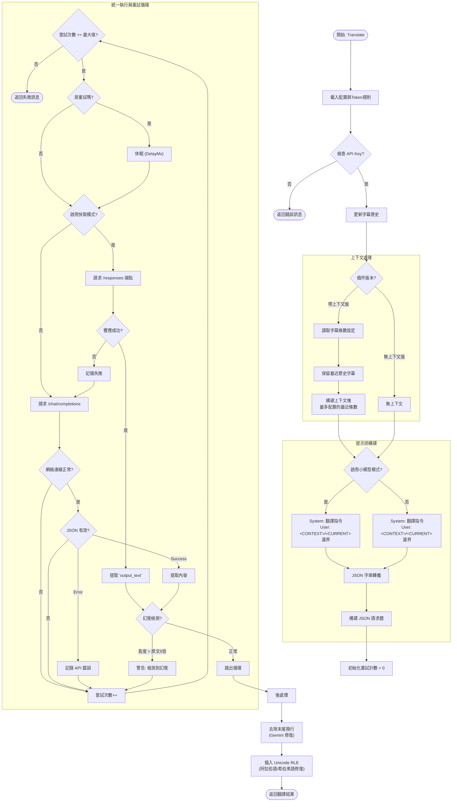

<a id="readme-top"></a>

[![Forks][forks-shield]]([forks-url])
[![Stargazers][stars-shield]]([stars-url])
[![Issues][issues-shield]]([issues-url])
[![License][license-shield]]([license-url])

<div align="right">
  <a href="https://github.com/Felix3322/PotPlayer_ChatGPT_Translate/blob/master/docs/readme_zh.md">简体中文</a> |
  <strong href="https://github.com/Felix3322/PotPlayer_ChatGPT_Translate/blob/master/docs/readme_zh-tw.md">繁体中文</strong> |
  <a href="https://github.com/Felix3322/PotPlayer_ChatGPT_Translate/blob/master/README.md">English</a>
</div>

<div align="center">
  <h3 align="center">PotPlayer_ChatGPT_Translate 🚀</h3>
  <p align="center">
    一款利用 ChatGPT API 提供即時、語境感知字幕翻譯的 PotPlayer 插件。✨
  </p>
    <p align="center">
    
  </p>
  <p align="center"><em>Works on my machine.</em></p>
  <p align="center">
    <a href="https://github.com/Felix3322/PotPlayer_ChatGPT_Translate/issues/new?labels=bug&template=bug-report---.md">🐞 回報 Bug</a>
    &nbsp;&middot;&nbsp;
    <a href="https://github.com/Felix3322/PotPlayer_ChatGPT_Translate/issues/new?labels=enhancement&template=feature-request---.md">💡 功能需求</a>
  </p>
</div>

<!-- HTML 目錄 (Table of Contents) -->

<div>
  <h2>📑 目錄</h2>
  <ol>
    <li>
      <a href="#安裝-">安裝</a>
      <ol>
        <li><a href="#全自動安裝推薦-">全自動安裝（推薦）</a></li>
        <li><a href="#手動安裝-">手動安裝</a></li>
      </ol>
    </li>
    <li><a href="#關於本專案-">關於本專案</a></li>
    <li><a href="#影片教學-">影片教學</a></li>
    <li><a href="#技術棧-">技術棧</a></li>
    <li><a href="#使用方法-">使用方法</a></li>
    <li><a href="#開發規劃-">開發規劃</a></li>
    <li><a href="#貢獻指南-">貢獻指南</a></li>
    <li><a href="#授權條款-">授權條款</a></li>
    <li><a href="#聯絡方式-">聯絡方式</a></li>
    <li><a href="#致謝-">致謝</a></li>
  </ol>
</div>

---

## 安裝 📦

### 全自動安裝（推薦） ⚡

1. **下載安裝程式：**
   [安裝程式](https://github.com/Felix3322/PotPlayer_ChatGPT_Translate/releases/latest)
   *(安裝程式為開源，可檢視其原始碼)*
2. **執行安裝程式（`installer.exe`）：**
   - 雙擊 `installer.exe` 開始安裝。
   - 若出現提示，請授權系統管理員權限。
3. **確認插件目錄：**
   - 安裝程式會自動偵測 PotPlayer 安裝路徑。
   - 確認目標目錄為：
     `...\PotPlayer\Extension\Subtitle\Translate`
   - 若你使用自訂安裝路徑，請手動選擇正確的 `Translate` 目錄。
4. **選擇插件版本：**
   - **有語境**（翻譯品質較佳，延遲略高）。
   - **無語境**（速度較快，連貫性較弱）。
5. **設定模型與 API 位址：**
   - **模型名稱：**填入模型 ID（例如：`gpt-4.1-nano`）。
   - **自訂 API 位址（可選）：**使用 `模型名稱|API 位址` 格式。
   - **不需要 Key 的介面：**先留空並驗證，通過後會寫入 `nullkey`。
6. **輸入 API Key（如需要）：**
   - 將 API Key 貼入輸入框。
   - 若介面不需要 Key，請留空並點擊 **驗證**，通過後安裝程式會寫入 `nullkey`。
7. **完成安裝：**
   - 點擊 **Install** 複製檔案。
   - 可選擇寫入解除安裝資訊，方便日後移除。
   - 注意：安裝程式寫入的預設值只會寫入一次；後續在 PotPlayer 面板調整會覆蓋安裝器預設值。

**安裝後請在 PotPlayer 中確認設定：**
1. **開啟 PotPlayer 偏好設定：**按 **F5**。
2. **進入擴充設定：**選擇 **擴充 > 字幕翻譯**。
3. **選擇插件：**選取 **ChatGPT 翻譯**。
4. **設定來源語言與目標語言**。

### 手動安裝 🔧

1. **下載 ZIP 檔案：**
   從本倉庫下載最新版 ZIP 檔。
2. **解壓 ZIP 檔：**
   將內容解壓到臨時資料夾。
3. **複製檔案：**
   將 `ChatGPTSubtitleTranslate.as` 和 `ChatGPTSubtitleTranslate.ico` 複製到以下目錄：

   ```
   C:\Program Files\DAUM\PotPlayer\Extension\Subtitle\Translate
   ```

   若你的 PotPlayer 安裝於其他路徑，請將 `C:\Program Files\DAUM\PotPlayer` 替換成對應路徑。
4. **在 PotPlayer 中設定：**
   1. 開啟 PotPlayer **偏好設定**（按 **F5**）。
   2. 進入 **擴充 > 字幕翻譯**。
   3. 選擇 **ChatGPT 翻譯**。
   4. 依需求設定 **模型名稱**、**API 位址** 與 **API Key**。
   5. 設定**來源語言**與**目標語言**。

<p align="right">(<a href="#readme-top">回到頂部</a>)</p>

---

### 配置參考 ⚙️

1. **模型名稱：**
   你可僅輸入模型名稱，系統會使用預設 API 介面 URL。
   **範例：**
   ```
   gpt-4.1-nano
   ```

   或者，也可指定自訂 API 介面 URL，格式如下：
   ```
   模型名稱|API 位址
   ```
   **範例：**
   ```
   gpt-4.1-nano|https://api.openai.com/v1/chat/completions
   ```

   > **備註：**
   > 在新版插件（v1.5）中，如需支援第三方 API 且不使用 API Key，可於第二個參數填入 `nullkey`。例如：
   > ```
   > gpt-4.1-nano|nullkey
   > ```
   > 或者：
   > ```
   > qwen2.5:7b|http://127.0.0.1:11434/v1/chat/completions|nullkey
   > ```
   >
   > **可選參數（v1.7+）：**
   > 使用 `|` 追加：
   > - `delay_ms`（純數字）：每次請求前等待的毫秒數
   > - `retryN`（N = 0–3）：重試模式
   >   - `retry0`：不重試
   >   - `retry1`：空回應時再嘗試一次
   >   - `retry2`：持續重試直到有回應（無延遲）
   >   - `retry3`：持續重試且每次都等待延遲
   > - `context=3`：語境版本使用，表示發送最近 3 條歷史字幕；設為 `0` 則不發送歷史字幕
   > - `cache=auto` / `cache=off`：語境快取模式（僅語境版本適用；auto 不支援時會自動回退到 chat）
   > - `smallmodel=0` / `smallmodel=1`：啟用小模型模式（針對小模型最佳化的提示詞）
   > - `checkhallucination=0` / `checkhallucination=1`：啟用幻覺檢測（若翻譯長度 > 原文5倍則重試）
   >
   > 完整範例：
   > ```
   > gpt-4.1-nano|https://api.openai.com/v1/chat/completions|nullkey|500|retry1|context=3|cache=auto|smallmodel=1|checkhallucination=1
   > ```

2. **API Key：**
   輸入你的 API Key。
   若介面不需要 Key，可留空並透過安裝器驗證空 Key；驗證通過後會寫入 `nullkey`。
   > 你可利用 **[keytest.obanarchy.org](https://keytest.obanarchy.org/)** 測試 API Key 是否有效。

3. **設定原語言與目標語言：**
   根據需求設置字幕來源與目標語言。

---

#### 模型填寫範例列表

格式如下：
```
模型名稱|API 位址|nullkey（可選）|delay_ms（可選）|retryN（可選）|context=3（可選）|cache=auto/off（可選）|smallmodel=0/1（可選）|checkhallucination=0/1（可選）
```

以下為已支援或可用的模型介面範例：

```
OpenAI GPT-5: gpt-5|https://api.openai.com/v1/chat/completions
OpenAI GPT-5 Mini: gpt-5-mini|https://api.openai.com/v1/chat/completions
OpenAI GPT-5 Nano: gpt-5-nano|https://api.openai.com/v1/chat/completions
OpenAI GPT-4.1: gpt-4.1|https://api.openai.com/v1/chat/completions
OpenAI GPT-4.1 Mini: gpt-4.1-mini|https://api.openai.com/v1/chat/completions
Gemini Flash: gemini-3-flash-preview|https://generativelanguage.googleapis.com/v1beta/openai/chat/completions
Deepseek: deepseek-chat|https://api.deepseek.com/v1/chat/completions
通義千問: qwen-plus|https://dashscope-intl.aliyuncs.com/compatible-mode/v1/chat/completions
矽基流動: siliconflow-chat|https://api.siliconflow.cn/v1/chat/completions
文心一言: ernie-4.0-turbo-8k|https://qianfan.baidubce.com/v2/chat/completions
Gemini: gemini-2.0-flash|https://generativelanguage.googleapis.com/v1beta/openai/chat/completions
ChatGLM: chatglm-6b|https://api.chatglm.cn/v1/chat/completions
LLaMA: llama-13b|https://api.llama.ai/v1/chat/completions
Code LLaMA: code-llama-34b|https://api.llama.ai/v1/code/completions
OpenAI GPT-4o: gpt-4o|https://api.openai.com/v1/chat/completions
OpenAI GPT-4 Turbo: gpt-4-turbo|https://api.openai.com/v1/chat/completions
OpenAI GPT-3.5 Turbo: gpt-3.5-turbo|https://api.openai.com/v1/chat/completions
Claude 3 Sonnet: claude-3-sonnet-20240229|https://api.anthropic.com/v1/messages
Mistral Large: mistral-large|https://api.mistral.ai/v1/chat/completions
Groq Llama 3: llama3-70b-8192|https://api.groq.com/openai/v1/chat/completions
Perplexity Sonar Large: pplx-70b-online|https://api.perplexity.ai/chat/completions
Fireworks Mixtral: accounts/fireworks/models/mixtral-8x7b-instruct|https://api.fireworks.ai/inference/v1/chat/completions
Moonshot v1: moonshot-v1-128k|https://api.moonshot.cn/v1/chat/completions
Yi 34B Chat: yi-34b-chat|https://api.lingyi.ai/v1/chat/completions
本地部署（無需 API Key）：模型名稱|http://127.0.0.1:端口/v1/chat/completions|nullkey
```

你亦可根據需求擴充其他支援 OpenAI 介面的模型，僅需確保其支援 `chat/completions` 介面。

<p align="right">(<a href="#readme-top">回到頂部</a>)</p>

---

## 關於本專案 💬

**PotPlayer\_ChatGPT\_Translate** 是一個 PotPlayer 插件，整合 ChatGPT API，實現即時、語境感知的字幕翻譯。不同於傳統翻譯工具，本插件可考慮上下文、慣用語與文化差異，提供更精確的翻譯。核心部分以 AngleScript 實現，結合 ChatGPT API 及 PotPlayer API，實現深度整合。

### 本插件亦相容任何採用與 ChatGPT 相同 API 調用方式的 AI 模型。

## 🔍 Google 翻譯 vs ChatGPT 翻譯

使用 ChatGPT 進行字幕翻譯的一大優勢在於它能理解上下文和文化參考。請參見下方對比：

* **原始字幕：**

  > *"You're gonna old yeller my f\*\*king universe."*

* **Google 翻譯結果：**

  > *"你要老了我他媽的宇宙嗎？"*
  > 
  > *(意義不明且不正確)*

* **ChatGPT 翻譯結果：**

  > *"你要像《老黃狗》一樣對待我的宇宙？"*
  > 
  > *(準確捕捉引用及其意圖)*

## 🧐 ChatGPT 無上下文 vs ChatGPT 有上下文

* **原始字幕：**

  > *"But being one in real life is even better."*

* **ChatGPT 翻譯（無上下文）：**

  > *"但是，在現實生活中成為一個人甚至更好。"*
  > 
  > *(字面翻譯，未能體現隱含意義)*

* **ChatGPT 翻譯（有上下文）：**

  > *"但在現實生活中成為反派更好。"*
  > 
  > *(準確捕捉語境)*

<p align="right">(<a href="#readme-top">回到頂部</a>)</p>

---

## 影片教學 🎥

點擊下方連結，在 Bilibili 上觀看教學影片：

<a href="https://www.bilibili.com/video/BV1w9FzegEbM" title="在 Bilibili 上觀看">
  
</a>

<p align="right">(<a href="#readme-top">回到頂部</a>)</p>

---

<details>
<summary><strong>🛠️ 邏輯流程圖 / Logic Flowchart</strong></summary>



</details>

<br>

## 構建工具 🛠

* **AngleScript** – 插件開發腳本語言
* **ChatGPT API** – 提供語境感知翻譯功能
* **PotPlayer API** – 與 PotPlayer 無縫整合

<p align="right">(<a href="#readme-top">回到頂部</a>)</p>

---

## 使用方法 ▶️

在 PotPlayer 播放帶有字幕的影片時，本插件會自動調用 ChatGPT API，進行即時字幕翻譯。透過處理語境、慣用語與文化差異，插件能提供更精確的翻譯結果。

例如：

* **輸入：** *"You're gonna old yeller my f\*\*king universe."*

  * **傳統翻譯工具** 可能會直譯或生硬翻譯。
  * **ChatGPT 翻譯** 則能捕捉電影引用與語境，給出貼切翻譯。

<p align="right">(<a href="#readme-top">回到頂部</a>)</p>

---

## 開發規劃 🗺

* [x] 集成 PotPlayer API 與 ChatGPT API，實現即時字幕翻譯。
* [ ] 支援更多 AI 模型（規劃中，近期內不實現）。
* [ ] 優化語境處理，進一步提升翻譯精度。

<p align="right">(<a href="#readme-top">回到頂部</a>)</p>

---

## 貢獻指南 🤝

歡迎任何貢獻！提交 Pull Request 時，請詳細描述你的修改內容。
若有改進建議或 Bug 修復，建議先於 Issue 討論。

<p align="right">(<a href="#readme-top">回到頂部</a>)</p>

---

## 授權條款 📄

本專案採 GPLv3 授權條款。詳情請參閱 `LICENSE` 檔案。

<p align="right">(<a href="#readme-top">回到頂部</a>)</p>

---

## 聯絡方式 📞

個人網站：[obanarchy.org](https://obanarchy.org)

<p align="right">(<a href="#readme-top">回到頂部</a>)</p>

---

## 致谢 🙏

* 感謝 OpenAI 提供強大的 ChatGPT API。
* 感謝 PotPlayer 團隊打造出色的多媒體播放器。
* 感謝所有為本專案建議或貢獻程式碼的朋友（貢獻者名單將於此更新）。

<p align="right">(<a href="#readme-top">回到頂部</a>)</p>

---

## Star History

[](https://www.star-history.com/#Felix3322/PotPlayer_ChatGPT_Translate&Date)

<!-- MARKDOWN LINKS & IMAGES -->

[stars-shield]: https://img.shields.io/github/stars/Felix3322/PotPlayer_ChatGPT_Translate.svg?style=for-the-badge
[stars-url]: https://github.com/Felix3322/PotPlayer_ChatGPT_Translate/stargazers
[forks-shield]: https://img.shields.io/github/forks/Felix3322/PotPlayer_ChatGPT_Translate.svg?style=for-the-badge
[forks-url]: https://github.com/Felix3322/PotPlayer_ChatGPT_Translate/network/members
[issues-shield]: https://img.shields.io/github/issues/Felix3322/PotPlayer_ChatGPT_Translate.svg?style=for-the-badge
[issues-url]: https://github.com/Felix3322/PotPlayer_ChatGPT_Translate/issues
[license-shield]: https://img.shields.io/github/license/Felix3322/PotPlayer_ChatGPT_Translate.svg?style=for-the-badge
[license-url]: https://github.com/Felix3322/PotPlayer_ChatGPT_Translate/blob/master/LICENSE
