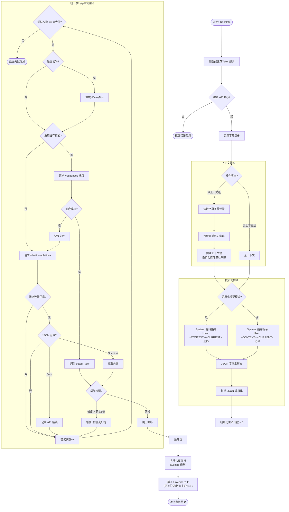

<a id="readme-top"></a>

[![Forks][forks-shield]]([forks-url])
[![Stargazers][stars-shield]]([stars-url])
[![Issues][issues-shield]]([issues-url])
[![License][license-shield]]([license-url])

<div align="right">
  <strong href="https://github.com/Felix3322/PotPlayer_ChatGPT_Translate/blob/master/docs/readme_zh.md">简体中文</strong> |
  <a href="https://github.com/Felix3322/PotPlayer_ChatGPT_Translate/blob/master/docs/readme_zh-tw.md">繁体中文</a> |
  <a href="https://github.com/Felix3322/PotPlayer_ChatGPT_Translate/blob/master/README.md">English</a>
</div>

<div align="center">
  <h3 align="center">PotPlayer_ChatGPT_Translate 🚀</h3>
  <p align="center">
    一个利用 ChatGPT API 提供实时、上下文感知字幕翻译的 PotPlayer 插件。✨
  </p>
    <p align="center">
    
  </p>
  <p align="center"><em>Works on my machine.</em></p>
  <p align="center">
    <a href="https://github.com/Felix3322/PotPlayer_ChatGPT_Translate/issues/new?labels=bug&template=bug-report---.md">🐞 报告 Bug</a>
    &nbsp;&middot;&nbsp;
    <a href="https://github.com/Felix3322/PotPlayer_ChatGPT_Translate/issues/new?labels=enhancement&template=feature-request---.md">💡 请求新功能</a>
  </p>
</div>

<!-- HTML 目录 (Table of Contents) -->
<div>
  <h2>📑 目录</h2>
  <ol>
    <li>
      <a href="#安装-">安装</a>
      <ol>
        <li><a href="#全自动安装推荐-">全自动安装（推荐）</a></li>
        <li><a href="#手动安装-">手动安装</a></li>
      </ol>
    </li>
    <li><a href="#关于项目-">关于项目</a></li>
    <li><a href="#视频教程-">视频教程</a></li>
    <li><a href="#技术栈-">技术栈</a></li>
    <li><a href="#使用方法-">使用方法</a></li>
    <li><a href="#开发计划-">开发计划</a></li>
    <li><a href="#贡献指南-">贡献指南</a></li>
    <li><a href="#许可证-">许可证</a></li>
    <li><a href="#联系方式-">联系方式</a></li>
    <li><a href="#致谢-">致谢</a></li>
  </ol>
</div>

---

## 安装 📦

### 全自动安装（推荐） ⚡

1. **下载安装程序：**
   [安装程序](https://github.com/Felix3322/PotPlayer_ChatGPT_Translate/releases/latest)
   *(安装程序是开源的，你可以查看其源码)*
2. **运行安装程序（`installer.exe`）：**
   - 双击 `installer.exe` 启动。
   - 如有提示，请授予管理员权限。
3. **确认插件目录：**
   - 安装器会自动检测 PotPlayer 安装路径。
   - 确认目标目录为：
     `...\PotPlayer\Extension\Subtitle\Translate`
   - 若你安装在自定义路径，请手动选择正确的 `Translate` 目录。
4. **选择插件版本：**
   - **有上下文**（翻译质量更好，延迟略高）。
   - **无上下文**（速度更快，连贯性略弱）。
5. **配置模型与 API 地址：**
   - **模型名称：**填写模型 ID（例如：`gpt-4.1-nano`）。
   - **自定义 API 地址（可选）：**使用 `模型名称|API 地址` 的格式。
   - **无需 Key 的接口：**请先留空并进行验证，验证通过后会写入 `nullkey`。
6. **输入 API Key（如需要）：**
   - 将 API Key 粘贴到输入框。
   - 若接口无需 Key，请留空并点击 **验证**，通过后安装器会写入 `nullkey`。
7. **完成安装：**
   - 点击 **Install** 复制文件。
   - 可选择写入卸载信息，方便后续卸载。
   - 注意：安装器写入的默认配置只会写入一次；之后在 PotPlayer 面板中修改会覆盖安装器默认值。

**安装后请在 PotPlayer 中核对设置：**
1. **打开 PotPlayer 首选项：**按 **F5**。
2. **进入扩展设置：**选择 **扩展 > 字幕翻译**。
3. **选择插件：**选中 **ChatGPT 翻译**。
4. **设置源语言与目标语言**。

### 手动安装 🔧

1. **下载 ZIP 文件：**
   从本仓库下载最新的 ZIP 文件。
2. **解压 ZIP 文件：**
   将内容解压到临时文件夹中。
3. **复制文件：**
   将 `ChatGPTSubtitleTranslate.as` 和 `ChatGPTSubtitleTranslate.ico` 复制到以下目录：

   ```
   C:\Program Files\DAUM\PotPlayer\Extension\Subtitle\Translate
   ```

   如果你的 PotPlayer 安装在其他位置，请将 `C:\Program Files\DAUM\PotPlayer` 替换为相应路径。
4. **在 PotPlayer 中配置：**
   1. 打开 PotPlayer **首选项**（按 **F5**）。
   2. 进入 **扩展 > 字幕翻译**。
   3. 选择 **ChatGPT 翻译**。
   4. 按需配置 **模型名称**、**API 地址** 与 **API Key**。
   5. 设置**源语言**与**目标语言**。

<p align="right">(<a href="#readme-top">返回顶部</a>)</p>

---

### 配置参考 ⚙️

1. **模型名称：**
   你可以仅输入模型名称，这时会使用默认的 API 接口 URL。
   **示例：**
   ```
   gpt-4.1-nano
   ```

   或者，你也可以通过指定自定义 API 接口 URL，格式为：
   ```
   模型名称|API 地址
   ```
   **示例：**
   ```
   gpt-4.1-nano|https://api.openai.com/v1/chat/completions
   ```

   > **备注：**
   > 在新版插件中（版本 1.5），如果需要支持第三方 API 接口且不使用 API Key，可以在第二个参数中填写 `nullkey`。例如：
   > ```
   > gpt-4.1-nano|nullkey
   > ```
   > 或者：
   > ```
   > qwen2.5:7b|http://127.0.0.1:11434/v1/chat/completions|nullkey
   > ```
   >
   > **可选参数（v1.7+）：**
   > 通过 `|` 追加：
   > - `delay_ms`（纯数字）：每次请求前等待的毫秒数
   > - `retryN`（N = 0–3）：重试模式
   >   - `retry0`：不重试
   >   - `retry1`：空响应时再尝试一次
   >   - `retry2`：持续重试直到有响应（无延迟）
   >   - `retry3`：持续重试且每次都等待延迟
   > - `context=3`：上下文版本使用，表示发送最近 3 条历史字幕；设为 `0` 则不发送历史字幕
   > - `cache=auto` / `cache=off`：上下文缓存模式（仅上下文版本适用；auto 不支持时自动回退到 chat）
   > - `smallmodel=0` / `smallmodel=1`：启用小模型模式（针对小模型优化的提示词）
   > - `checkhallucination=0` / `checkhallucination=1`：启用幻觉检测（若翻译长度 > 原文5倍则重试）
   >
   > 完整示例：
   > ```
   > gpt-4.1-nano|https://api.openai.com/v1/chat/completions|nullkey|500|retry1|context=3|cache=auto|smallmodel=1|checkhallucination=1
   > ```

2. **API Key：**
   输入你的 API Key。
   若接口无需 Key，可留空并通过安装器验证空 Key；验证通过后会写入 `nullkey`。
   > 你可以使用 **[keytest.obanarchy.org](https://keytest.obanarchy.org/)** 测试 API Key 是否有效。

3. **设置源语言和目标语言：**
   根据需要配置字幕的源语言和目标语言。

---

#### 模型填写示例列表

使用格式如下：
```
模型名称|API 地址|nullkey（可选）|delay_ms（可选）|retryN（可选）|context=3（可选）|cache=auto/off（可选）|smallmodel=0/1（可选）|checkhallucination=0/1（可选）
```

以下是已支持或可用的模型接口示例：

```
OpenAI GPT-5: gpt-5|https://api.openai.com/v1/chat/completions
OpenAI GPT-5 Mini: gpt-5-mini|https://api.openai.com/v1/chat/completions
OpenAI GPT-5 Nano: gpt-5-nano|https://api.openai.com/v1/chat/completions
OpenAI GPT-4.1: gpt-4.1|https://api.openai.com/v1/chat/completions
OpenAI GPT-4.1 Mini: gpt-4.1-mini|https://api.openai.com/v1/chat/completions
Gemini Flash: gemini-3-flash-preview|https://generativelanguage.googleapis.com/v1beta/openai/chat/completions
Deepseek: deepseek-chat|https://api.deepseek.com/v1/chat/completions
通义千问: qwen-plus|https://dashscope-intl.aliyuncs.com/compatible-mode/v1/chat/completions
硅基流动: siliconflow-chat|https://api.siliconflow.cn/v1/chat/completions
文心一言: ernie-4.0-turbo-8k|https://qianfan.baidubce.com/v2/chat/completions
Gemini: gemini-2.0-flash|https://generativelanguage.googleapis.com/v1beta/openai/chat/completions
ChatGLM: chatglm-6b|https://api.chatglm.cn/v1/chat/completions
LLaMA: llama-13b|https://api.llama.ai/v1/chat/completions
Code LLaMA: code-llama-34b|https://api.llama.ai/v1/code/completions
OpenAI GPT-4o: gpt-4o|https://api.openai.com/v1/chat/completions
OpenAI GPT-4 Turbo: gpt-4-turbo|https://api.openai.com/v1/chat/completions
OpenAI GPT-3.5 Turbo: gpt-3.5-turbo|https://api.openai.com/v1/chat/completions
Claude 3 Sonnet: claude-3-sonnet-20240229|https://api.anthropic.com/v1/messages
Mistral Large: mistral-large|https://api.mistral.ai/v1/chat/completions
Groq Llama 3: llama3-70b-8192|https://api.groq.com/openai/v1/chat/completions
Perplexity Sonar Large: pplx-70b-online|https://api.perplexity.ai/chat/completions
Fireworks Mixtral: accounts/fireworks/models/mixtral-8x7b-instruct|https://api.fireworks.ai/inference/v1/chat/completions
Moonshot v1: moonshot-v1-128k|https://api.moonshot.cn/v1/chat/completions
Yi 34B Chat: yi-34b-chat|https://api.lingyi.ai/v1/chat/completions
本地部署（无需 API Key）：模型名称|http://127.0.0.1:端口/v1/chat/completions|nullkey
```

你也可以根据需要扩展其他兼容 OpenAI 接口的模型，确保它们支持 `chat/completions` 接口。


<p align="right">(<a href="#readme-top">返回顶部</a>)</p>

---

## 关于项目 💬

**PotPlayer_ChatGPT_Translate** 是一个 PotPlayer 插件，它整合了 ChatGPT API，以实现实时、上下文感知的字幕翻译。与传统翻译工具不同，该插件能够考虑上下文、惯用语和文化差异，从而提供更准确的翻译。项目的核心部分使用 AngleScript 实现，并结合了 ChatGPT API 与 PotPlayer API 实现深度集成。
### 该插件同样兼容任何使用与 ChatGPT 相同 API 调用方式的 AI 模型。

## 🔍 Google 翻译 vs ChatGPT 翻译

使用 ChatGPT 进行字幕翻译的一大优势在于它能够理解上下文和文化参考。请看下面的对比：

- **原始字幕：**
  > *"You're gonna old yeller my f**king universe."*

- **Google 翻译结果：**
  > *"你要老了我他妈的宇宙吗?"*
  
  _(意义不明且不正确)_

- **ChatGPT 翻译结果：**
  > *"你要像《老黄犬》一样对待我的宇宙?"*
  
  _(准确捕捉了引用及其意图)_

##  🧐 ChatGPT 无上下文 vs ChatGPT 有上下文对比

- **原始字幕：**
  > *"But being one in real life is even better."*

- **ChatGPT 翻译结果（无上下文）：**
  > *"但是，在现实生活中成为一个人甚至更好。"*
  
  _(字面翻译，未能体现隐含意义)_

- **ChatGPT 翻译结果（有上下文）：**
  > *"但在现实生活中成为一个反派更好。"*
  
  _(准确捕捉语境)_

<p align="right">(<a href="#readme-top">返回顶部</a>)</p>

---

## 视频教程 🎥

点击下面的视频链接，在 Bilibili 上观看教程：

<a href="https://www.bilibili.com/video/BV1w9FzegEbM" title="在 Bilibili 上观看">
  
</a>

<p align="right">(<a href="#readme-top">回到顶部</a>)</p>

---

<details>
<summary><strong>🛠️ 逻辑流程图 / Logic Flowchart</strong></summary>



</details>

<br>

## 构建工具 🛠

- **AngleScript** – 用于开发插件的脚本语言
- **ChatGPT API** – 提供上下文感知的翻译功能
- **PotPlayer API** – 实现与 PotPlayer 的无缝集成

<p align="right">(<a href="#readme-top">返回顶部</a>)</p>

---

## 使用方法 ▶️

在 PotPlayer 播放带有字幕的视频时，该插件会自动调用 ChatGPT API 实现实时字幕翻译。通过对上下文、惯用语和文化差异的处理，插件提供了更为精准的翻译。

例如：
- **输入：** *"You're gonna old yeller my f**king universe."*
  - **传统翻译工具** 可能会输出直译或生硬的翻译。
  - **ChatGPT 翻译** 则能捕捉电影引用和上下文，提供更贴切的翻译结果。

<p align="right">(<a href="#readme-top">返回顶部</a>)</p>

---

## 开发计划 🗺

- [x] 与 PotPlayer API 集成 ChatGPT API，实现实时字幕翻译。
- [ ] 支持更多 AI 模型（计划中，近期内不实现）。
- [ ] 优化上下文处理，进一步提高翻译准确性。

<p align="right">(<a href="#readme-top">返回顶部</a>)</p>

---

## 贡献指南 🤝

欢迎所有贡献！在提交 Pull Request 时，请清楚描述你所做的修改内容。
如果你有改进建议或 Bug 修复，请在修改前先通过 Issue 进行讨论。

<p align="right">(<a href="#readme-top">返回顶部</a>)</p>

---

## 许可证 📄

本项目采用 GPLv3 许可证进行分发。更多信息请参阅 `LICENSE` 文件。

<p align="right">(<a href="#readme-top">返回顶部</a>)</p>

---

## 联系方式 📞

个人网站：[obanarchy.org](https://obanarchy.org)

<p align="right">(<a href="#readme-top">返回顶部</a>)</p>

---

## 致谢 🙏

- 感谢 OpenAI 提供强大的 ChatGPT API。
- 感谢 PotPlayer 团队打造出色的媒体播放器。
- 感谢所有对本项目提出建议或贡献代码的朋友（贡献者名单会在此更新）。

<p align="right">(<a href="#readme-top">返回顶部</a>)</p>

---

## Star History

[](https://www.star-history.com/#Felix3322/PotPlayer_ChatGPT_Translate&Date)

<!-- MARKDOWN LINKS & IMAGES -->
[stars-shield]: https://img.shields.io/github/stars/Felix3322/PotPlayer_ChatGPT_Translate.svg?style=for-the-badge
[stars-url]: https://github.com/Felix3322/PotPlayer_ChatGPT_Translate/stargazers
[forks-shield]: https://img.shields.io/github/forks/Felix3322/PotPlayer_ChatGPT_Translate.svg?style=for-the-badge
[forks-url]: https://github.com/Felix3322/PotPlayer_ChatGPT_Translate/network/members
[issues-shield]: https://img.shields.io/github/issues/Felix3322/PotPlayer_ChatGPT_Translate.svg?style=for-the-badge
[issues-url]: https://github.com/Felix3322/PotPlayer_ChatGPT_Translate/issues
[license-shield]: https://img.shields.io/github/license/Felix3322/PotPlayer_ChatGPT_Translate.svg?style=for-the-badge
[license-url]: https://github.com/Felix3322/PotPlayer_ChatGPT_Translate/blob/master/LICENSE
